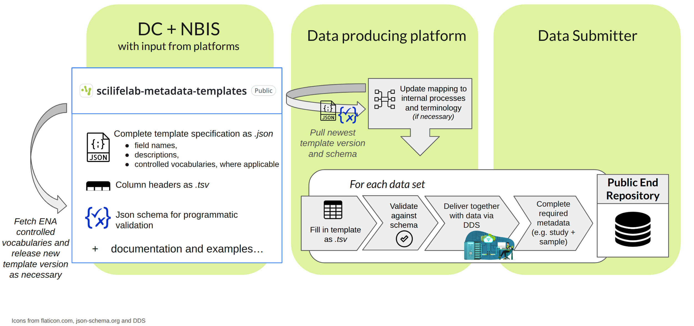

# SciLifeLab Metadata Templates

This repository stores metadata templates in use at SciLifeLab, organized according to data type. It focuses on capturing technical metadata, i.e. metadata about the experiments and technologies used to generate the data it describes. These metadata are mostly collected at the data producing platforms at SciLifeLab. The information flow between this repository, the data producing platforms and the data submitter with the end goal of data submission to a public end repository is sketched in the diagram below.

## Specific templates available

| Title | Description | Link |
| ----- | ----------- | ---- |
| SciLifeLab Genomics Technical Metadata Template | This template aims to capture technical metadata for genomics data produced at the Genomics platform, compatible with submission requirements from ENA and ArrayExpress. | [genomics/README.md](https://github.com/ScilifelabDataCentre/scilifelab-metadata-templates/blob/main/genomics/README.md) | 

## General template structure

A template has a _title_, a _description_ and a _semantic version_ number, as well as well as a list of associated attribute fields.

Within a template each technical _attribute field_ needs to have:
- Field name: identifier for the attribute
- Level of requirement/cardinality (mandatory vs optional)
    - `mandatory_for_data_producer`: to be filled in by the data producing facility as far as possible
    - `mandatory_for_data_submitter`: to be filled in by the data submitter, not expected to be known by the data producing facility
- Description
- List of controlled vocabulary terms, if applicable
- Target (end) repository: end repository which this metadata attribute targets 
- Target (end repository) field name: the exact name of the corresponding metadata attribute field at the end repository

In addition to data type specific fields capturing the technical metadata itself, all templates include additional __organizational metadata__ such as 
- SciLifeLab infrastructure platform and unit
- Unit internal project ID(s)
- Associated order ID
- Experimental Sample IDs (as assigned by the unit, 1 exp sample = 1 data file (pair))
- Associated Sample IDs (as shared by the researcher with the unit)
- Metadata file creation date
- Template name
- Template version

Templates are provided as _.tsv_, _.json_ and _.json schema_. A row entry for an individual sample in a filled out _.tsv_ would then correspond to the following information

| <data_type_specific_field1> |...| <data_type_specific_fieldM> | <data_file_name_R1> |...|<data_file_name_RP>| <orga_meta_field1>|...| <orga_meta_fieldN> |
| --------------------------- | - | --------------------------- | ------------------- | - | ----------------- | ----------------- | - | ------------------ |

## Contact 

For __questions relating to this repository__ and the use of its metadata templates at SciLifeLab in general, please contact data-management@scilifelab.se and put "metadata-templates" as a keyword. For specific __questions about filled-in metadata files received together with data__ produced at SciLifeLab please __contact the data producing unit directly__. 

This repository is maintained by [SciLifeLab Data Centre](https://www.scilifelab.se/data/) and [NBIS](https://nbis.se/). The data-type specific metadata templates are created in collaboration with SciLifeLab data producing platforms. For contributors to individual metadata templates please see the relevant subsection on the specific template readme pages. 

